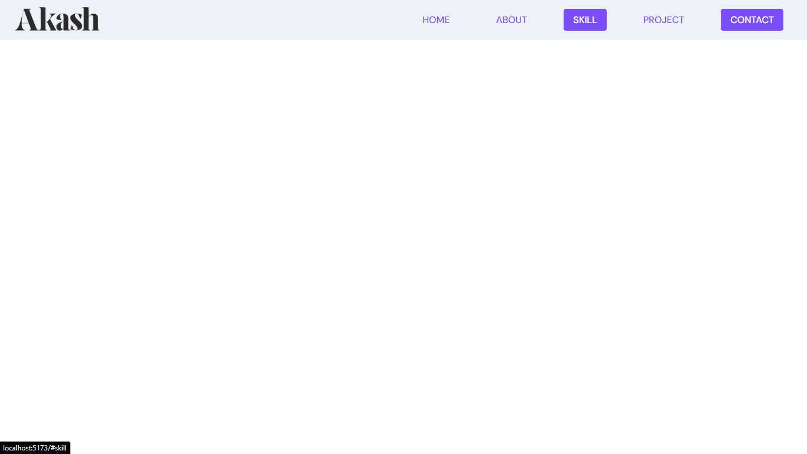

# NavBar Component



This is a simple navbar component that you can use for your portfolio.

## Getting Started

1. Clone the repository
2. Run the following commands:

```bash
cd your-repository
npm i
npm run dev
```

3. Change the logo in the `assets` folder and rename the new image to `logo.png`. You can customize all the styles in the `.scss` files. If you want to add more features, feel free to do so using the BEM naming convention or any other naming convention to keep it consistent.
4. You can use the navbar separately or build on top of this project.

## Technologies Used

This Navigation Bar is built using React + Vite. You can learn more about them in their official documentation:

- [React Official Docs](https://reactjs.org/)
- [Vite Official Docs](https://vitejs.dev/)

## Project Structure

The project follows a simple structure:

- `src` directory contains the source code.
- `assets` directory holds the logo and other assets.
- Styles can be modified in the `.scss` files.

## React + Vite Template

This template provides a minimal setup to get React working in Vite with Hot Module Replacement (HMR) and some ESLint rules.

Official plugins used:

- [@vitejs/plugin-react](https://github.com/vitejs/vite-plugin-react/blob/main/packages/plugin-react/README.md) uses [Babel](https://babeljs.io/) for Fast Refresh.
- [@vitejs/plugin-react-swc](https://github.com/vitejs/vite-plugin-react-swc) uses [SWC](https://swc.rs/) for Fast Refresh.

Feel free to explore and enhance the project based on your needs, and refer to the official documentation links for in-depth knowledge on React and Vite.
